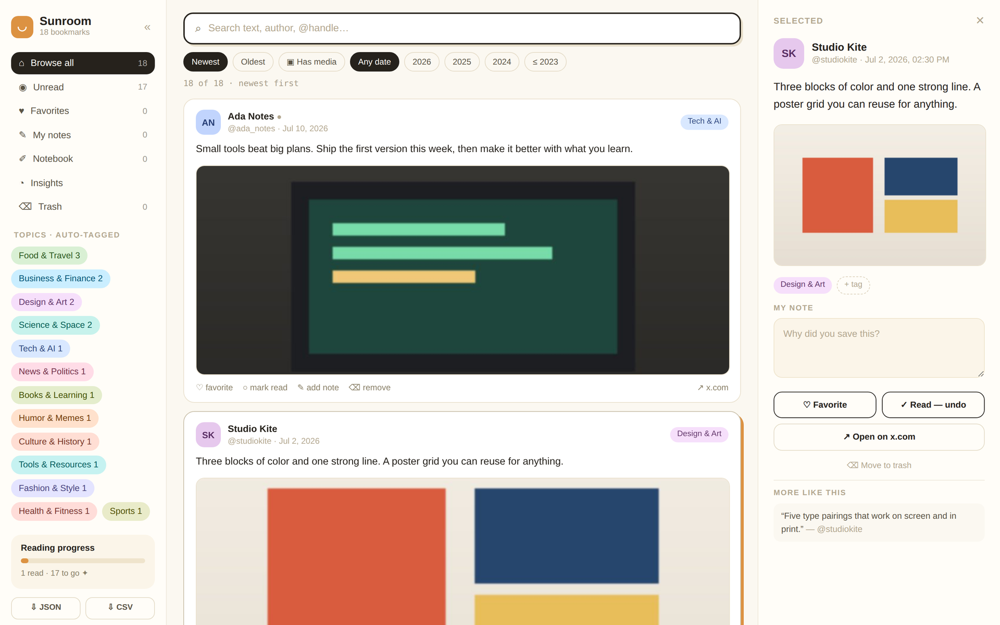
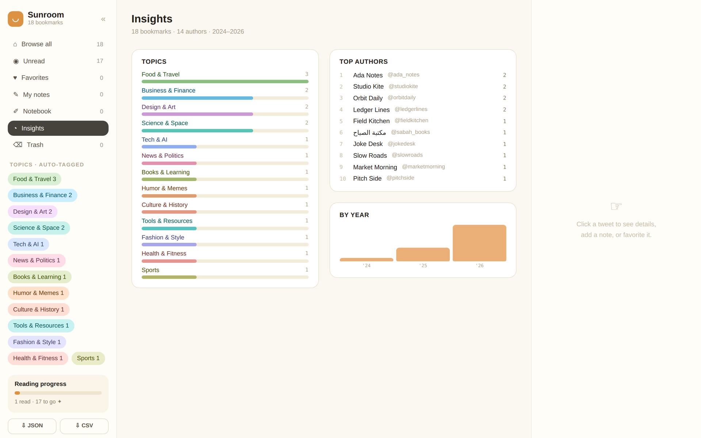
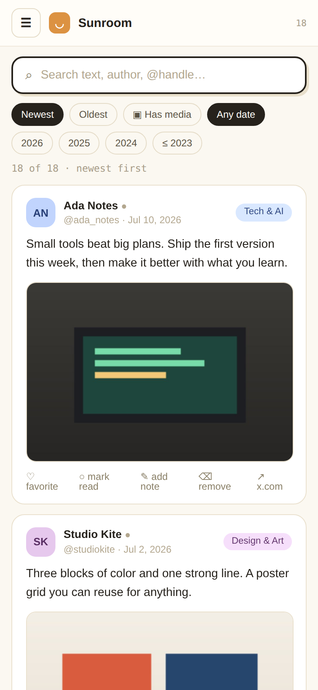
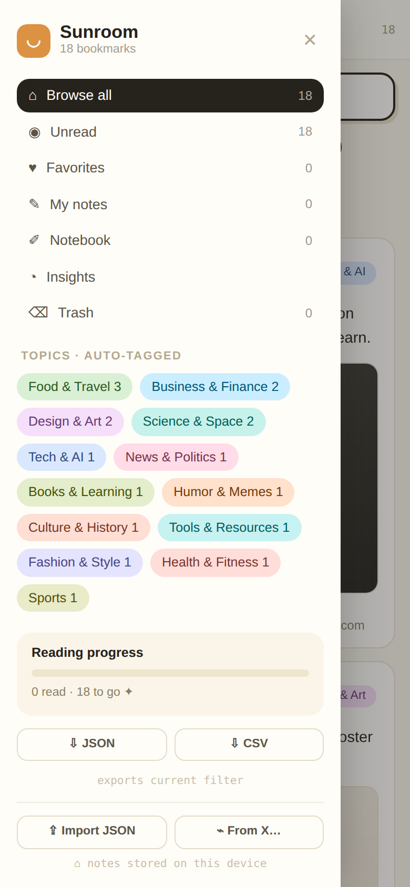

<div align="center">

# ☀️ Sunroom

**A calm, warm place to read your X (Twitter) bookmarks.**

Browse, search, tag and take notes on everything you saved, sorted into topics for you.
Runs on your own machine. Your bookmarks never leave it unless you deploy.




</div>

## What it does

- **Sorts itself.** Every bookmark lands in one of 18 topics, from Tech & AI to Food & Travel. The sorter reads English and Arabic, knows some accounts by name, and looks at links and emoji. Add your own labels and they always win.
- **Finds anything.** Search text, names and @handles. Filter by topic, author, year, or posts with pictures.
- **Remembers what you think.** Favorite, mark read, add a note, add your own tags. Keep loose notes and links in the Notebook.
- **Shows the big picture.** Insights shows your topics, top authors and saves per year.
- **Keeps things tidy.** Remove a bookmark and it goes to Trash, where you can bring it back at any time.
- **Exports.** Download what you're looking at as JSON or CSV, notes and tags included.
- **Works on your phone.** On small screens the menu slides in and each post opens full screen.
- **Reads Arabic properly.** Right-to-left posts display the right way round.

<table>
  <tr>
    <td width="62%"></td>
    <td width="19%"></td>
    <td width="19%"></td>
  </tr>
  <tr>
    <td align="center"><sub>Insights</sub></td>
    <td align="center"><sub>Feed on a phone</sub></td>
    <td align="center"><sub>Menu on a phone</sub></td>
  </tr>
</table>

<sub>Screenshots use the made-up sample bookmarks that ship with the repo.</sub>

## Quick start

```bash
git clone https://github.com/njarrar/sunroom-app
cd sunroom-app
npm install
npm run dev
```

Open the address it prints. With no bookmarks of your own yet, you'll see the sample set.

## Bring in your bookmarks

**1. Export them from X.** In the app, open the menu and pick **From X…**. It gives you a short script. Open [x.com/i/bookmarks](https://x.com/i/bookmarks), paste the script into the browser console, and it scrolls through your bookmarks and downloads `bookmarks_export.json`.

**2. Load them.** Pick one:

| | How | Good for |
|---|---|---|
| **Quick** | Menu → **Import JSON**, pick the file | Trying it out. Sorted in the browser and saved on that device only. |
| **Full** | Put `bookmarks_export.json` in the project folder, then run the commands below | Keeping it. Applies your labels and saves pictures locally. |

```bash
node scripts/categorize.js      # sort bookmarks into topics → src/data/bookmarks.json
node scripts/download_media.js  # save pictures to public/media/
npm run dev
```

> [!NOTE]
> **Your data stays out of git.** `bookmarks_export.json`, `src/data/bookmarks.json`, `scripts/overrides.json` and `public/media/` are all in `.gitignore`. Fork and push freely.

## Your own labels

Disagree with a topic? Put the fix in `scripts/overrides.json`, keyed by post id:

```json
{
  "1234567890123456789": "Design & Art"
}
```

Run `node scripts/categorize.js` again. Your labels always beat the automatic sorter.

## Put it online (optional)

Sunroom can run on Cloudflare Pages for free, with your notes and tags syncing between devices through Workers KV. [DEPLOY.md](DEPLOY.md) walks through it, including the Cloudflare Access step that keeps the site private to you.

```bash
npm run deploy
```

## How it's built

| Part | Where |
|---|---|
| The app (React + Vite) | `src/App.jsx` |
| Topic sorter, shared by scripts and browser | `src/lib/classify.js` |
| Notes and tags sync | `src/lib/sync.js`, `functions/api/store.js` |
| Export, sort and picture scripts | `scripts/` |
| Sample data | `src/data/bookmarks.sample.json`, `public/sample/` |

Notes, tags, favorites and read state save to your browser at once. When the app runs on Cloudflare, they also sync to your other devices.
